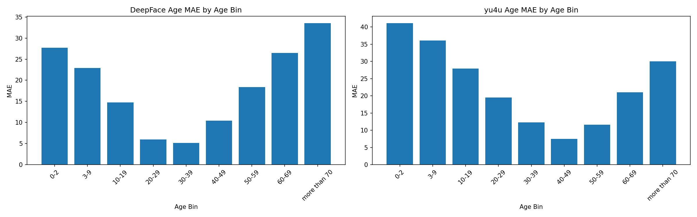
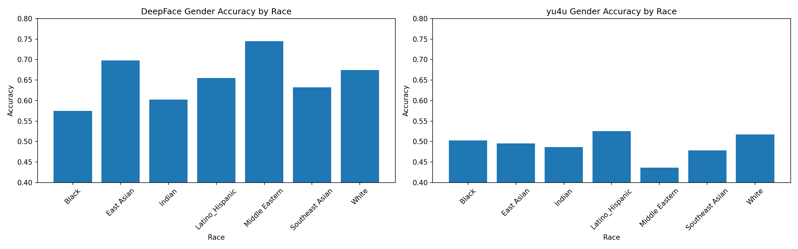
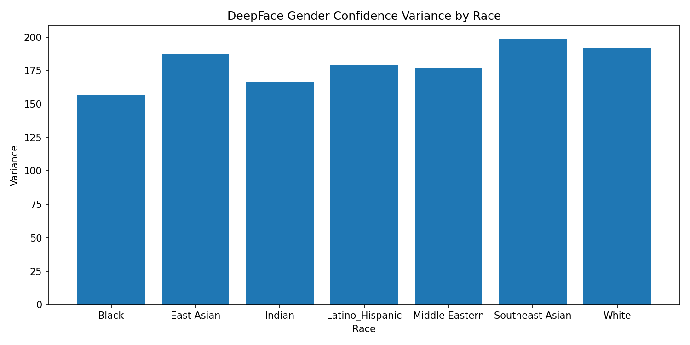

# Benchmarking Open Source Face Inference ML Models
This analysis compares the performance of various open-source ML models to TikTok's proprietary ML models to see if they make the same mistakes outlined in original paper. The selected open-source ML models are tested using a subset of the FairFace dataset to benchmark their performance on infering age and gender for various ethnic groups.

# Phase 1 #

## Understanding the dataset ##

The FairFace dataset includes thousands of datapoints, which means testing each ML model on the whole dataset will cost quite a lot of time. Therefore, I have to work with a subset of the dataset. An initial analysis on the dataset and how it is distributed will give me a better idea on the sampling strategy I should follow.

As the first step, I loaded the validation split of the FairFace dataset to understand the dataset. The dataset is available through Hugging Face. The validation split consists of 10954 images. 

Then I printed the first datapoint to understand its structure. I saw that for each datapoint, there are `image`, `age`, `gender`, `race`, and `service_test` attributes. 

After that, I visualized how the data is distributed across age, race, and gender. I found out that the validation split is reasonably balanced across race and gender, but the age attribute is heavily skewed toward 20-39 year olds which mirrors real life photo sharing demographics. 

Then, I analyzed the **race x age**, **race x gender**, and **age x gender** contingency tables to inform my sampling strategy. I found out that the `0-2` age bin has a gender imbalance (76F vs 123M) that cannot be corrected, and the `more than 70` age bin has too few samples in several race groups for statistically robust conclusions. Results from these bins will be treated as descriptive rather than inferential. Additionally, there is a gender imbalance in images with the race `Middle Eastern` (396F vs 813M). 

## Sampling Strategy ##

Thus, I came up with the following sampling strategy: get all images in the `0-2` and `more than 70` age bins regardless of race or gender, get all the images in the `3-9` and `10-19` age bins too since they're central to replicating the paper's findings about minors, and for all the other age bins, cap each race group at 50 images.

The Python code I used to do this initial assesment can be found in [`dataset_analysis.py`](https://gitlab.cs.mcgill.ca/bhagya.chembakottu/comp555-project-2-group-1/-/blob/main/analysis1/dataset_analysis.py) (to run it, you can install the dependencies listed in the [`requirements_ds_analysis.txt`](https://gitlab.cs.mcgill.ca/bhagya.chembakottu/comp555-project-2-group-1/-/blob/main/analysis1/requirements_ds_analysis.txt)), and the visualization of the data distribution can be found in [`fairface_distributions.png`](https://gitlab.cs.mcgill.ca/bhagya.chembakottu/comp555-project-2-group-1/-/blob/main/analysis1/figures/fairface_distributions.png).

# Phase 2 #

## ML Model Selection ##

To justify the selection of the ML models I'm going to test and compare to the findings in West et al.'s paper, I searched ACM Digital Library, IEEE Xplore, and Google Scholar to scan the current literature. I found two papers that are useful for my analysis: [**HyperExtended LightFace: A Facial Attribute Analysis Framework (Serengil et al. 2021)**](https://gitlab.cs.mcgill.ca/bhagya.chembakottu/comp555-project-2-group-1/-/blob/main/analysis1/references/HyperExtended_LightFace_A_Facial_Attribute_Analysis_Framework.pdf?ref_type=heads), and [**Deep Expectation of Real and Apparent Age from a Single Image Without Facial Landmarks (Rothe et al. 2018)**](https://gitlab.cs.mcgill.ca/bhagya.chembakottu/comp555-project-2-group-1/-/blob/main/analysis1/references/Deep_Expectation_of_Real_and_Apparent_Age_from_a_Single_Image_Without_Facial_Landmarks.pdf?ref_type=heads). The first paper references the second paper. 

Rothe et al. (2018) introduce the DEX (Deep EXpectation) method and the IMDB-WIKI dataset (523,051 face images with both age and gender labels), achieving high accuracy in age estimation (MAE of 2.68 on MORPH) using a VGG-16 architecture with softmax expected value over 101 age bins. The authors also document that models trained on IMDB-WIKI exhibit systematic bias when tested on out-of-distribution data, a finding that directly motivates my analysis.

Serengil & Ozpinar (2021) implement this approach in DeepFace, an open-source Python framework, reporting age MAE of 4.65 and gender accuracy of 97.44% on an IMDB-WIKI test split. The paper confirms that DeepFace's age and gender models are trained exclusively on IMDB-WIKI, with no FairFace overlap.

I also identified a [**GitHub repository**](https://github.com/yu4u/age-gender-estimation) developed mainly by [Yusuke Uchida](https://github.com/yu4u) that also uses the method of Rothe et al. (2018) to build a model, training on the same IMDB-WIKI dataset using the VGG-16 architecture with softmax expected value for age and binary classification for gender. This model is significant for my analysis because DeepFace (Serengil & Ozpinar, 2021) and Uchida's implementation share the same underlying approach and training data but were developed entirely independently. Consistent demographic disparities across both models would suggest that observed performance gaps are maybe due to the properties of the IMDB-WIKI training distribution rather than any implementation specific detail.

Therefore, I ended up finding two solid models to test and compare: DeepFace and yu4u/age-gender-estimation. 

# Phase 3 #

The revised list of dependencies used for this phase can be found in [`requirements_final.txt`](https://gitlab.cs.mcgill.ca/bhagya.chembakottu/comp555-project-2-group-1/-/blob/main/analysis1/requirements_final.txt).

## Sampling ##

Following the sampling strategy I outlined earlier, I collected samples from the FairFace validation split. I ran [`sampling.py`](https://gitlab.cs.mcgill.ca/bhagya.chembakottu/comp555-project-2-group-1/-/blob/main/analysis1/sampling.py?ref_type=heads) and saved 4544 samples in [`fairface_sample.csv`](https://gitlab.cs.mcgill.ca/bhagya.chembakottu/comp555-project-2-group-1/-/blob/main/analysis1/data/fairface_sample.csv).

## Inference ##

I ran DeepFace on the 4544 sampled images using [`deepface_inference.py`](https://gitlab.cs.mcgill.ca/bhagya.chembakottu/comp555-project-2-group-1/-/blob/main/analysis1/deepface_inference.py). For each image, DeepFace predicted an age (continuous value), a dominant gender ("Man" or "Woman"), and a gender confidence score (probability distribution over both classes). Results were saved to [`deepface_results.csv`](https://gitlab.cs.mcgill.ca/bhagya.chembakottu/comp555-project-2-group-1/-/blob/main/analysis1/data/deepface_results.csv). I also ran the yu4u/age-gender-estimation model using [`yu4u_inference.py`](https://gitlab.cs.mcgill.ca/bhagya.chembakottu/comp555-project-2-group-1/-/blob/main/analysis1/yu4u_inference.py), which predicts age via softmax expected value over 101 age bins and gender via binary classification. Results were saved to [`yu4u_results.csv`](https://gitlab.cs.mcgill.ca/bhagya.chembakottu/comp555-project-2-group-1/-/blob/main/analysis1/data/yu4u_results.csv). Both inference scripts were run on a Google Colab T4 GPU instance.

## Statistical Analysis ##

I ran [`statistical_analysis.py`](https://gitlab.cs.mcgill.ca/bhagya.chembakottu/comp555-project-2-group-1/-/blob/main/analysis1/statistical_analysis.py) to analyze the results from both models against the two key findings in West et al. (2024).

### Finding 1 — Age Prediction Fails for Minors ###

I computed MAE between each model's predicted age and the midpoint of the true age bin, then grouped by age bin. Both models show the same pattern: lowest error for adults aged 20–49 and sharply rising error for minors and elderly individuals.

| Age Bin      | DeepFace MAE | yu4u MAE |
|:-------------|-------------:|---------:|
| 0-2          | 27.74        | 41.06    |
| 3-9          | 22.93        | 36.09    |
| 10-19        | 14.77        | 27.90    |
| 20-29        | 5.95         | 19.49    |
| 30-39        | 5.15         | 12.26    |
| 40-49        | 10.42        | 7.53     |
| 50-59        | 18.36        | 11.64    |
| 60-69        | 26.45        | 20.98    |
| more than 70 | 33.51        | 30.05    |

Both models mispredict the age of infants (0-2) and young children (3-9), supporting West et al.'s finding that TikTok's model predicted a median age of 13 for the 0-2 bin. Kruskal-Wallis tests confirmed that age error differences across bins are statistically significant for both DeepFace (H=2967.3, p=0) and yu4u (H=2289.6, p=0). The consistent pattern across two independently developed models both trained on IMDB-WIKI strongly suggests that the discrepancy can be due to the training data distribution rather than any implementation-specific issue.

### Finding 2 — Gender Prediction is Problematic for Black Individuals ###

I computed gender accuracy per race group for both models:

| Race            | DeepFace Accuracy | yu4u Accuracy |
|:----------------|------------------:|--------------:|
| Black           | 57.47%            | 50.27%        |
| Indian          | 60.21%            | 48.63%        |
| Southeast Asian | 63.26%            | 47.85%        |
| Latino/Hispanic | 65.51%            | 52.50%        |
| White           | 67.45%            | 51.69%        |
| East Asian      | 69.76%            | 49.54%        |
| Middle Eastern  | 74.53%            | 43.63%        |

DeepFace supports West et al.'s finding that Black individuals have the lowest gender accuracy at 57.47%, and the differences across race groups are statistically significant (H=31.1, p=0.000024). However, yu4u performance suggests that all race groups perform around 50%, and the differences are not statistically significant (H=11.4, p=0.077). This shows that DeepFace's race-specific gender discrepancy may be partially related to implementation, while the age discrepancy is consistent across both models.

## Visualizations ##

**Age MAE by Age Bin (DeepFace vs yu4u)**

**Gender Accuracy by Race (DeepFace vs yu4u)**

**DeepFace Gender Confidence Variance by Race**

